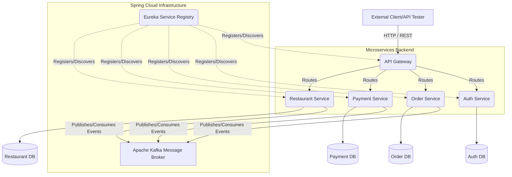
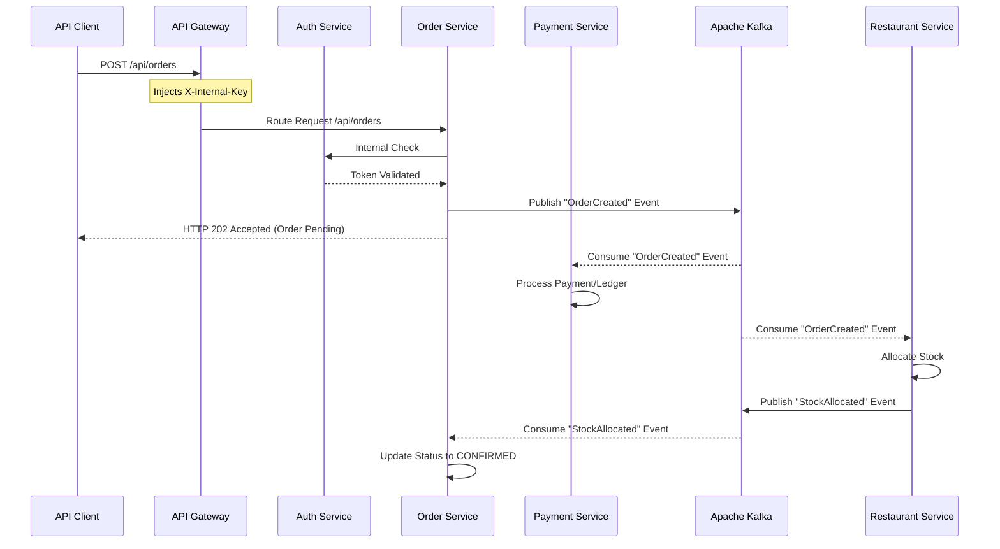

# Food Delivery Platform Architecture (Backend)

This document defines the system architecture, operational flow, and technical specifications for the Food Delivery Application's microservices ecosystem.

## 1. System Architecture

The application is built on a distributed microservices architecture, utilizing Spring Cloud for routing and discovery, and Apache Kafka for event-driven asynchronous communication.



### Backend Specifications
*   **Language**: Java 25
*   **Framework**: Spring Boot 4.0.5
*   **Cloud Infrastructure**: Spring Cloud 2025.1.1 (Gateway, OpenFeign, Netflix Eureka)
*   **Resilience**: Resilience4j (Circuit Breakers, Retries)
*   **Message Broker**: Apache Kafka (Managed via `spring-boot-starter-kafka`)
*   **Security**: Spring Security, JWT (jjwt 0.11.5), Internal API Key Validation
*   **ORM**: Spring Data JPA

### Monitoring & Observability Tools (PLG Stack)
*   **Metrics**: Prometheus (Exposing metrics via OTLP)
*   **Logs**: Grafana Loki (Log aggregation via OTLP)
*   **Dashboards**: Grafana (Unified visualization)
*   **Distributed Tracing**: Micrometer Tracing & Tempo (OTLP Traces)

### Database Specifications
*   **RDBMS**: MySQL (Local Installation using mysql-connector-j)

## 2. Project Structure

```text
/Food Delivery Application
├── .gitignore              # IDE and system build settings
├── docker-compose.yml      # Infrastructure Orchestration (Variables for all ports)
├── prometheus.yml          # OTLP Metrics Configuration
├── tempo.yaml              # OTLP Tracing Configuration
├── api-gateway/            # Secured Gateway with JWT & Internal Keys
├── auth-service/           # Identity & JWT Management
├── order-service/          # Order Lifecycle & Kafka Events
├── payment-service/        # Ledger & Payment Integration
├── restaurant-service/     # Menu & Stock Management
└── service-registry/       # Eureka Discovery Server
```

## 3. Interservice Communication Map

The backend utilizes **Spring Cloud OpenFeign** for synchronous operations and **Apache Kafka** for asynchronous domain events. All internal requests are secured via an `X-Internal-Key` handshake injected by the Gateway.



## 4. Operational Flow

1.  **Authentication**: All requests require a valid JWT generated by the `auth-service`.
2.  **Edge Verification**: The API Gateway intercepts the request, validates the JWT, and attaches a secure `X-Internal-Key` header.
3.  **Service Trust**: Downstream services (Order, Restaurant, etc.) only accept requests that contain the correct `X-Internal-Key`, preventing direct access bypass.
4.  **Observability**: All services push telemetry (logs, metrics, and traces) via **OTLP** to the centralized monitoring stack.

## 5. Startup Order

1.  **Infrastructure Core**: Kafka, MySQL (Local), Loki, Prometheus, Tempo, Grafana.
2.  **Service Registry (`service-registry`)**.
3.  **API Gateway (`api-gateway`)**.
4.  **Auth Service (`auth-service`)**.
5.  **Core Domain Services (`order-service`, `payment-service`, `restaurant-service`)**.
